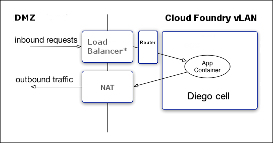

# Container Security

Refer to https://docs.cloudfoundry.org/concepts/container-security.html

## Container Mechanics

Each instance of an app deployed to CF runs within its own self-contained environment, a Garden container. This container isolates processes, memory, and the filesystem using operating system features and the characteristics of the virtual and physical infrastructure where CF is deployed.

CF achieves container isolation by namespacing kernel resources that would otherwise be shared. The intended level of isolation is set to prevent multiple containers that are present on the same host from detecting each other. Every container includes a private root filesystem, which includes a Process ID (PID), namespace, network namespace, and mount namespace.

CF creates container filesystems using the Garden Rootfs (GrootFS) tool. It stacks the following using OverlayFS:

- **A read-only base filesystem:** This filesystem has the minimal set of operating system packages and Garden-specific modifications common to all containers. Containers can share the same read-only base filesystem because all writes are applied to the read-write layer.

- **A container-specific read-write layer:** This layer is unique to each container and its size is limited by XFS project quotas. The quotas prevent the read-write layer from overflowing into unallocated space.

Resource control is managed using Linux control groups (cgroups). Associating each container with its own cgroup or job object limits the amount of memory that the container may use. Linux cgroups also require the container to use a fair share of CPU compared to the relative CPU share of other containers.

## Inbound and Outbound Traffic from CF

A host VM has a single IP address. If you configure the deployment with the cluster on a VLAN, as recommended, then all traffic goes through the following levels of network address translation, as shown in the diagram below.

- **Inbound** requests flow from the load balancer through the router to the host cell, then into the application container. The router determines which application instance receives each request.

- **Outbound** traffic flows from the application container to the cell, then to the gateway on the cell’s virtual network interface. Depending on your IaaS, this gateway may be a NAT to external networks.

## Network Traffic Rules

Administrators configure these rules at two levels:

- **Application Security Groups (ASGs)** apply network traffic rules at the **container level**.

- **Container-to-Container networking policies** determine app-to-app communication. Within CF, apps can communicate directly with each other, but the containers are isolated from outside CF.

## Container Security

Garden has two container types: **unprivileged** and **privileged**. Currently, CF runs all application instances and staging tasks in unprivileged containers by default. This measure increases security by eliminating the threat of root escalation inside the container. Operators can override these defaults by customizing their Diego deployment manifest and redeploying.

- To enable privileged containers for buildpack-based apps, set the `capi.nsync.diego_privileged_containers` property to `true` in the Diego manifest.

- To enable privileged containers for staging tasks, set the `capi.stager.diego_privileged_containers` property to `true` in the Diego manifest.

