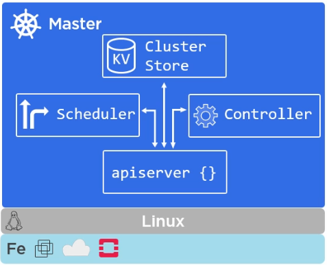
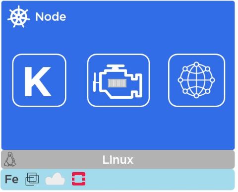

# Kubernetes

## Kubernetes Architecture

- Masters
- Nodes
- Pods
- Services
- Deployments

### Masters

**kube-apiserver**

- Front-end to the control plane
- Exposes the API (Rest)
- Consumes JSON (via manifest files)
- Port 443

**Cluster store**

- Persistent storage
- Cluster state and config
- Uses etcd
- Distributed, consistent, watchable...
- The "source of truth" for the cluster
- Have a backup plan for it

**kube-controller-manager**

- Controller of controllers (node ontroller, endpoints controller, namespace controller, ...)
- Watches for changes
- Helps maintain desired state

**kube-scheduler**

- Watches apiserver for new pods
- Assigns work to nodes (affinity/anti-affinity, constraints, resources, ...)

### Nodes

**kubelet**

- The main Kubernetes agent
- Registers node with cluster
- Watches **apiserver**
- Instantiates **pods**
- Reports back to **master**
- Exposes endpoint on :10255 (/spec /healthz /pods)

**Container Engine

- Does container management: (Pulling images; Starting/stopping containers; ...)
- Pluggable: Usually **Docker**; Can be **rkt**.

**kube-proxy**

- Kubernetes networking: 
-- Pod IP addresses (All containers in a pod share a single IP)
- Load balances across all pods in a **service**

