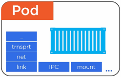
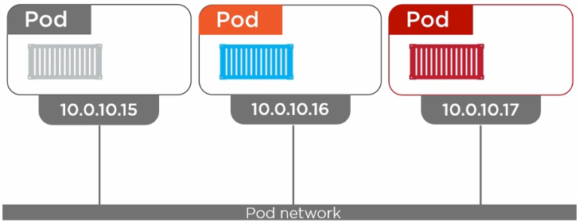
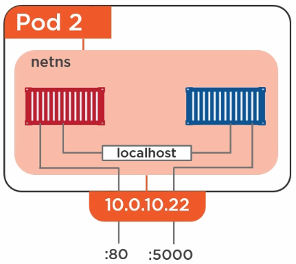
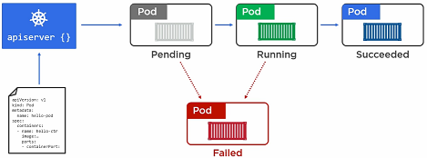
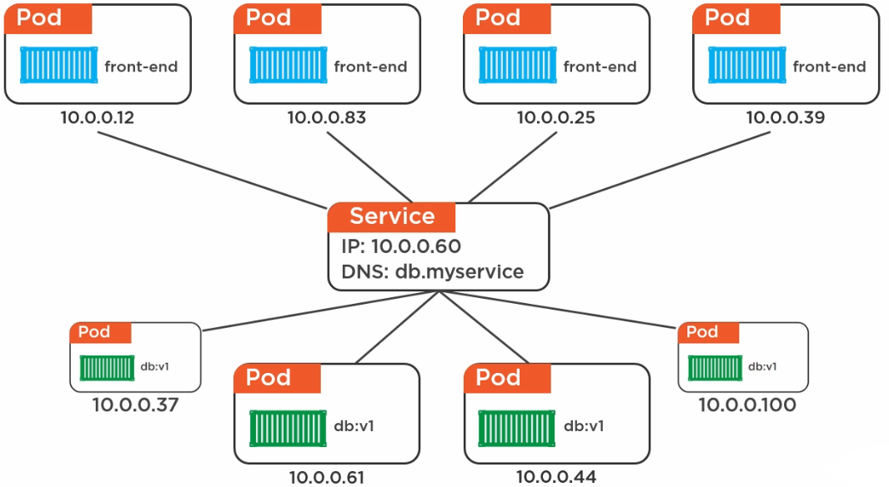
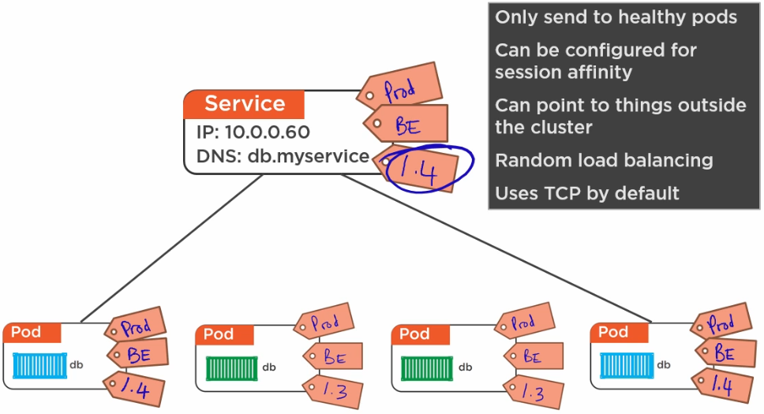

# Kubernetes Architecture

**Desired State** (Declarative Model: manifest file) vs. **Actual State**

- [Masters](#Masters)
- [Nodes](#Nodes)
- [Pods](#Pods)
- [Services](#Services)
- [Deployments](#Deployments)

## Masters

**kube-apiserver**

- Front-end to the control plane
- Exposes the API (Rest)
- Consumes JSON (via manifest files)
- Port 443

**Cluster store**

- Persistent storage
- Cluster state and config
- Uses etcd
- Distributed, consistent, watchable...
- The "source of truth" for the cluster
- Have a backup plan for it

**kube-controller-manager**

- Controller of controllers (node ontroller, endpoints controller, namespace controller, ...)
- Watches for changes
- Helps maintain desired state

**kube-scheduler**

- Watches apiserver for new pods
- Assigns work to nodes (affinity/anti-affinity, constraints, resources, ...)

## Nodes

**kubelet**

- The main Kubernetes agent
- Registers node with cluster
- Watches **apiserver**
- Instantiates **pods**
- Reports back to **master**
- Exposes endpoint on :10255 (/spec /healthz /pods)

**Container Engine**

- Does container management: Pulling images; Starting/stopping containers; ...
- Pluggable: Usually **Docker**; Can be **rkt**.

**kube-proxy**

- Kubernetes networking: Pod IP addresses (All containers in a pod share a single IP)
- Load balances across all pods in a **service**

## Pods

- A pod can have one or more containers. All containers in pod share the pod environment. 
- Pod is the smallest/atomic unit of scheduling.
- Pod is scheduled on nodes.
- pod is declarative via manifest files.

**One pod one IP** (single network namespace)

Inter-pod communication

Intra-pod communication

**Pod Lifecycle** (mortal): no resurrection.

**Deploying Pods**: usually via higher level objects (**Replication Controller**)

## Services

The way that a pod belongs to a service is via **labels**.

## Deployments

Simple rolling updates and rollbacks.

- Multiple concurrent versions (blue-green deployments; Canary releases)
- Simple versioned rollbacks

