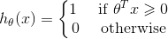

# Supervised Learning - Regression Problem

## Linear Regression

Hypothesis Function: &nbsp; $h_{\theta}(x)=\theta_{0}+\theta_{1}x$

Parameters: &nbsp; $\theta_{0}$, $\theta_{1}$

Cost Function: &nbsp; $cost(h_{\theta}(x),y)=\frac{1}{2}(h_{\theta}(x)-y)^{2}$

Cost Function: &nbsp; $J(\theta)=\frac{1}{2m}\sum_{i=1}^{m}(h_{\theta}(x^{(i)})-y^{i})^{2}$

Goal: &nbsp; $\underset{\theta}{minimize}~J(\theta)$

 

## Polynomial Regression

Hypothesis Function: &nbsp; $h_{\theta}(x)=\theta_{0}+\theta_{1}x_{1}+\theta_{2}x_{1}^{2}~~\Rightarrow ~~h_{\theta}(x)=\theta_{0}+\theta_{1}x_{1}+\theta_{2}x_{2}$ &nbsp;&nbsp; (where $x_{2}=x_{1}^{2}$)

Hypothesis Function: &nbsp; $h_{\theta}(x)=\theta_{0}+\theta_{1}x_{1}+\theta_{2}\sqrt{x_{1}}~~\Rightarrow ~~h_{\theta}(x)=\theta_{0}+\theta_{1}x_{1}+\theta_{2}x_{2}$ &nbsp;&nbsp; (where $x_{2}=\sqrt{x_{1}}$)

 

# Supervised Learning - Classification Problem

large *n* relative to *m*: **Logistic Regression**, **SVM without kernel**.

Small *n*, intermediate *m*: **SVM with Gaussian kernel**.

Small *n*, large *m*: **Logistic Regression** (more features), **SVM without kernel**.

**Neural Network**: for all, but slow to train.

## Logistic Regression

Hypothesis representation is **Sigmoid Function** which is also called **Logistic Function**.

Hypothesis Function: &nbsp; $h_{\theta }(x)=\frac{1}{1+e^{-\theta^{T}x}}$

cost Function: &nbsp; $cost(h_{\theta}(x),y)=-y~log(h_{\theta}(x))-(1-y)~log(1-h_{\theta}(x))$ &nbsp;&nbsp;&nbsp;&nbsp; ($y=0$ or $y=1$)

cost Function: &nbsp; $J(\theta)=-\frac{1}{m}\sum_{i=1}^{m}[y^{(i)}log(h_{\theta}(x^{(i)}))+(1-y^{(i)})log(1-h_{\theta}(x^{(i)}))]$

 

The logistic hypothesis function $h_{\theta}(x)$ gives us the probability that the output is 1.
- $h_{\theta}(x)=0.7 ~~\Rightarrow ~ $ 70% 
- $h_{\theta}(x)=P(y=1|x;\theta)=1-P(y=0|x;\theta)$

 

**Decision Boundary :** Decision boundary is the line that separates the area where $y=0$ and $y=1$. It is created by the hypothesis function. For logistic function, the decision boundary is $\theta^{T}x=0$.

 

## Multiclass Classification

Use **One-vs-All** (**One-vs-Rest**)

&nbsp;&nbsp;&nbsp;&nbsp;&nbsp; $y\in \{ 0, 1,  ... , n \}$

&nbsp;&nbsp;&nbsp;&nbsp;&nbsp; $h_{\theta}^{(0)}(x)=P(y=0|x; \theta)$

&nbsp;&nbsp;&nbsp;&nbsp;&nbsp; $\vdots$

&nbsp;&nbsp;&nbsp;&nbsp;&nbsp; $h_{\theta}^{(n)}(x)=P(y=n|x; \theta)$

&nbsp;&nbsp;&nbsp;&nbsp;&nbsp; $prediction=\underset{i}{max}(h_{\theta}^{(i)}(x))$

 

## Linear SVM (Support Vector Machine)

**SVM (Support Vector Machine)** cost function from logistic regression cost function:

&nbsp;&nbsp;&nbsp;&nbsp;&nbsp; $\underset{\theta}{min}~C\sum_{i=1}^{m}[y^{(i)}cost_{1}(\theta^{T}x^{(i)})+(1-y^{(i)})cost_{0}(\theta^{T}x^{(i)})]+\frac{1}{2}\sum_{j=1}^{n}\theta_{j}^{2}$

&nbsp;&nbsp;&nbsp;&nbsp;&nbsp; where &nbsp; $cost_{1}(\theta^{T}x^{(i)})=-log~h_{\theta}(x^{(i)}) ~~~$ (when $y=1$)

&nbsp;&nbsp;&nbsp;&nbsp;&nbsp; where &nbsp; $cost_{0}(\theta^{T}x^{(i)})=-log~(1-h_{\theta}(x^{(i)})) ~~~$ (when $y=0$)

Unlike logistic, $h_{\theta}(x)$ doesn't give us a probability, but instead we get a direct prediction of 1 or 0. Hypothesis Function: 

&nbsp;&nbsp;&nbsp;&nbsp;&nbsp; 

**Large Margin Intuition**: If you have a positive example, you only really need $\theta^{T}x$ to be greater or equal to 0. SVM wants a bit more than that. If $y=1$, we want $\theta^{T}x$ greater or equal to 1. If $y=0$, we want $\theta^{T}x$ less or equal to -1.

&nbsp;&nbsp;&nbsp;&nbsp;&nbsp; 

**SVM is a convex function**.

 

## SVM for Non-Linear Classification (Kernel)

Hypothesis Function:

&nbsp;&nbsp;&nbsp;&nbsp;&nbsp; 

Another way of writing this is that a hypothesis computes a decision boundary by taking the sum of the parameter vector multiplied by a new feature vector $f$, which simply contains the various high order $x$ terms.

&nbsp;&nbsp;&nbsp;&nbsp;&nbsp; $h_{\theta}(x)=\theta_{0}+\theta_{1}f_{1}+\theta_{2}f_{2}+\theta_{3}f_{3}+\cdots$

&nbsp;&nbsp;&nbsp;&nbsp;&nbsp; where &nbsp; $f_{1}=x_{1},~f_{2}=x_{2},~f_{3}=x_{1}x_{2},\cdots$

 

**Use Kernel**:

- Manually choose **landmarks**, $l^{(1)},~l^{(2)},~l^{(3)},\cdots$. You can choose $l^{(1)}=x^{(1)},~l^{(2)}=x^{(2)},\cdots,~l^{(m)}=x^{(m)}$
- Given $x$, define $f_{1}$ as the similarity between $x$ and $l^{(1)}$

&nbsp;&nbsp;&nbsp;&nbsp;&nbsp;&nbsp;&nbsp;&nbsp;&nbsp; 

- The similarity function is called a **kernel**. Instead of writing *similarity*, we might write $f_{1}=k(x,l^{(1)})$
- Train $\underset{\theta}{min}~C\sum_{i=1}^{m}[y^{(i)}cost_{1}(\theta^{T}f^{(i)})+(1-y^{(i)})cost_{0}(\theta^{T}f^{(i)})]+\frac{1}{2}\sum_{j=1}^{n}\theta_{j}^{2}$ , where $n=m$.
- Not all similarity functions make valid kernels. Need to satisfy technical condition "Mercer's Theorem" to make sure SVM packages' optimizations run correctly and do not diverge.

 

**Gaussian Kernel**

Gaussian similarity function uses Gaussian distribution. When use Gaussian Kernel, you need to choose $\sigma^2$. Gaussian Similarity function: $k(x,l^{(i)})=exp(-\frac{\left \| x-l^{(i)}\right \|^{2}}{2\sigma^2})$

- If $x\approx l^{(i)}$, &nbsp; $k(x,l^{(i)})\approx1$

- If $x$ far from $l^{(i)}$, &nbsp; $k(x,l^{(i)})\approx0$

When use Gaussian Kernel, you need to choose $C=\frac{1}{\lambda}$ and $\sigma^{2}$.
Large $C$: Low bias, high variance.

Small $C$: High bias, low variance.

Large $\sigma^{2}$: high bias, low variance.

Small $\sigma^{2}$: low bias, high variance.

 

**Linear Kernel**

Linear kernel is also no kernel.

- Predict $y=1$, if $\theta^{T}x>=0$

 

**Polynomial Kernel**

We measure the similarity of $x$ and $l$ by doing one of $(x^{T}l)^{2}$, $(x^{T}l)^{3}$, $(x^{T}l+1)^{3}$. The general form is $(x^{T}l+constant)^{D}$.

 

## Neural Network

- Number of input units: dimension of features $x^{(i)}$
- Number of output units: number of classes
- Activation units
- Bias nodes $x_{0}$

**Cost Function**:

&nbsp;&nbsp;&nbsp;&nbsp;&nbsp; 

**Backpropagation Algorithm**: backpropagation is neural network termonology for minimizing cost function.

**Unrolling parameters**: In order to use optimizing functions such as *fminunc*, we will want to unrill all the elements and put them into one long vector.

**Gradient Checking**: verify backpropagation algorithm correct. Only need to use it once. A small value for $\epsilon$ such as $\epsilon=10^{-4}$ guarantees that the math works out properly. But if the value for $\epsilon$ is too small, we can end up with numerical problems.

&nbsp;&nbsp;&nbsp;&nbsp;&nbsp; $\frac{\partial}{\partial\Theta }J(\Theta )\approx \frac{J(\Theta+\epsilon)-J(\Theta-\epsilon)}{2\epsilon}$

**Random Initialization**: symmetry breaking

&nbsp;&nbsp;&nbsp;&nbsp;&nbsp; $\Theta$ - random values in $[-\epsilon, \epsilon]$

 

# Unsupervised Learning - Clustering

## K-Means

K is the number of clusters. The process is

1. Randomly choose centroids $\mu$
2. Group $x^{(i)}$ which is closest to $\mu^{(i)}$
3. Calculate the average (mean) of $x$ in each group
4. Compute cost function (distortion) $J=\frac{1}{m}\sum_{i=1}^{m}\left \| x^{(i)}-\mu_{c}^{(i)} \right \|^{2}$ .
5. Repeat 2-4, pick clustering that gave lowest cost $J$.

**Choose $k$**: Sometimes you are running K-means to get clusters to use for some later/downstream purpose. Evaluate K-means based on a metric for how well it performs for that later purpose.

 

# PCA: Principal Component Analysis

Reduce data from n-dimensions to k-dimensions

&nbsp;&nbsp;&nbsp;&nbsp;&nbsp; $[u,s,v]=svd(sigma)$

&nbsp;&nbsp;&nbsp;&nbsp;&nbsp; $U_{reduce}=u(:,1:k)$

&nbsp;&nbsp;&nbsp;&nbsp;&nbsp; $z=U_{reduce}'\times x$ &nbsp;&nbsp; ($z\in R^{k}$, $x\in R^{n}$)

 

**Choose K**: choose k to be the smallest so that "**99% of variance is retained**" (95-99% is commonly used).

&nbsp;&nbsp;&nbsp;&nbsp;&nbsp; 

 

**Application of PCA**: Dimensionality Reduction

- Data Compression: reduce memory/disk needed to store data, or speed up learning algorithm.
- Data Visualization: reduce dimension to 2 or 3 so that we can plot 2D or 3D data.
- Bad use of PCA: to prevent overfitting.

 

# Anomaly Detection

Three broad categories of anomaly detection techniques: Unsupervised anomaly detection techniques, Supervised anomaly detection techniques and Semi-supervised anomaly detection techniques.

**Gaussian Distribution** (Normal Distribution): 

&nbsp;&nbsp;&nbsp;&nbsp;&nbsp; $P(x;\mu,\sigma^{2})=\frac{1}{\sqrt{2\pi}\cdot \sigma}exp(-\frac{(x-\mu)^{2}}{2\sigma ^{2}})$

&nbsp;&nbsp;&nbsp;&nbsp;&nbsp; $\mu=\frac{1}{m}\sum_{m=1}^{m}x^{(i)}$ &nbsp;, &nbsp;&nbsp; $\sigma^{2}=\frac{1}{m}\sum_{m=1}^{m}(x^{(i)}-\mu)^{2}$

&nbsp;&nbsp;&nbsp;&nbsp;&nbsp; Density Estimation: $P(x)=\prod_{j=1}^{n}P(x_{j};\mu_{j},\sigma_{j}^{2})$

&nbsp;&nbsp;&nbsp;&nbsp;&nbsp; Anomaly if $P(x)< \epsilon$

 

**Applications of Anomaly Detection**: Anomaly detection is applicable in a variety of domains, such as intrusion detection, fraud detection, fault detection, system health monitoring, event detection in sensor networks, and detecting Eco-system disturbances. It is often used in preprocessing to remove anomalous data from the dataset.

# Optimization Algorithms

- Gradient Descent
- Conjugate Gradient - **Pros:** no need to pick $\alpha$, fast. **Cons:** complex
- BFGS - **Pros:** no need to pick $\alpha$, fast. **Cons:** complex
- L-BFGS - **Pros:** no need to pick $\alpha$, fast. **Cons:** complex
- Normal Equation - Too expensive: need to calculate inverse of matrix

## Gradient Descent

Repeat until convergence: &nbsp; $\theta_{j}:=\theta_{j}-\alpha\frac{\partial}{\partial \theta_{j}}J(\theta)$

Where $j$ represents the feature index number. $\alpha$ is called **Learning Rate**.

- Batch Gradient Descent: uses all the training data at one time

# Others

- Feature Scaling
- Mean Normalization
- Regularization: address overfitting (Regularization Parameter $\lambda$)
- Convex Function: bowl-shaped function
- Contour plot
