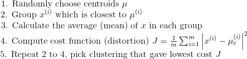
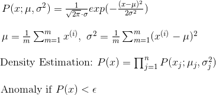
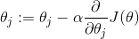

# Table of Contents

1. [Supervised Learning - Regression Problem](#supervised-learning-regression-problem)
2. [Linear Regression](#linear-regression)
3. [Polynomial Regression](#polynomial-regression)
4. [Supervised Learning - Classification Problem](#supervised-learning- classification-problem)
5. [Logistic Regression](#logistic-regression)
6. [Multiclass Classification](#multiclass-classification)
7. [Linear SVM (Support Vector Machine)](#linear-svm-support-vector-machine)
8. [SVM for Non-Linear Classification (Kernel)](#svm-for-non-linear-classification-kernel)
9. [Neural Network](#neural-network)
10. [Unsupervised Learning - Clustering](#unsupervised-learning-clustering)
11. [K-Means](#k-means)
12. [PCA: Principal Component Analysis](#pca-principal-component-analysis)
13. [Anomaly Detection](#anomaly-detection)
14. [Recommender System](#recommender-system)
15. [Gradient Descent](#gradient-descent)
16. [Online Learning](#online-learning)
17. [Skewed Data](#skewed-data)
18. [Others](#others)

# Supervised Learning - Regression Problem

## Linear Regression

## Polynomial Regression

 

# Supervised Learning - Classification Problem

large *n* relative to *m*: **Logistic Regression**, **SVM without kernel**.

Small *n*, intermediate *m*: **SVM with Gaussian kernel**.

Small *n*, large *m*: **Logistic Regression** (more features), **SVM without kernel**.

**Neural Network**: for all, but slow to train.

## Logistic Regression

## Multiclass Classification

Use **One-vs-All** (**One-vs-Rest**)

&nbsp;&nbsp;&nbsp;&nbsp;&nbsp; 

&nbsp;&nbsp;&nbsp;&nbsp;&nbsp; 

## Linear SVM (Support Vector Machine)

**SVM (Support Vector Machine)** cost function from logistic regression cost function:

&nbsp;&nbsp;&nbsp;&nbsp;&nbsp; 

Unlike logistic, $h_{\theta}(x)$ doesn't give us a probability, but instead we get a direct prediction of 1 or 0. Hypothesis Function: 

&nbsp;&nbsp;&nbsp;&nbsp;&nbsp; 

**Large Margin Intuition**: If you have a positive example, you only really need $\theta^{T}x$ to be greater or equal to 0. SVM wants a bit more than that. If $y=1$, we want $\theta^{T}x$ greater or equal to 1. If $y=0$, we want $\theta^{T}x$ less or equal to -1.

&nbsp;&nbsp;&nbsp;&nbsp;&nbsp; 

**SVM is a convex function**.

 

## SVM for Non-Linear Classification (Kernel)

Hypothesis Function:

&nbsp;&nbsp;&nbsp;&nbsp;&nbsp; 

Another way of writing this is that a hypothesis computes a decision boundary by taking the sum of the parameter vector multiplied by a new feature vector *f*, which simply contains the various high order *x* terms.

&nbsp;&nbsp;&nbsp;&nbsp;&nbsp; 

 

**Use Kernel**:

- Manually choose **landmarks**, $l^{(1)},~l^{(2)},~l^{(3)},\cdots$. You can choose $l^{(1)}=x^{(1)},~l^{(2)}=x^{(2)},\cdots,~l^{(m)}=x^{(m)}$
- Given $x$, define $f_{1}$ as the similarity between $x$ and $l^{(1)}$

&nbsp;&nbsp;&nbsp;&nbsp;&nbsp;&nbsp;&nbsp;&nbsp;&nbsp; 

- The similarity function is called a **kernel**. Instead of writing *similarity*, we might write $f_{1}=k(x,l^{(1)})$
- Train $\underset{\theta}{min}~C\sum_{i=1}^{m}[y^{(i)}cost_{1}(\theta^{T}f^{(i)})+(1-y^{(i)})cost_{0}(\theta^{T}f^{(i)})]+\frac{1}{2}\sum_{j=1}^{n}\theta_{j}^{2}$ , where $n=m$.
- Not all similarity functions make valid kernels. Need to satisfy technical condition "Mercer's Theorem" to make sure SVM packages' optimizations run correctly and do not diverge.

 

**Gaussian Kernel**

Gaussian similarity function uses Gaussian distribution. When use Gaussian Kernel, you need to choose $\sigma^2$. Gaussian Similarity function: $k(x,l^{(i)})=exp(-\frac{\left \| x-l^{(i)}\right \|^{2}}{2\sigma^2})$

- If $x\approx l^{(i)}$, &nbsp; $k(x,l^{(i)})\approx1$

- If $x$ far from $l^{(i)}$, &nbsp; $k(x,l^{(i)})\approx0$

When use Gaussian Kernel, you need to choose $C=\frac{1}{\lambda}$ and $\sigma^{2}$.
Large $C$: Low bias, high variance.

Small $C$: High bias, low variance.

Large $\sigma^{2}$: high bias, low variance.

Small $\sigma^{2}$: low bias, high variance.

 

**Linear Kernel**

Linear kernel is also no kernel.

- Predict $y=1$, if $\theta^{T}x>=0$

 

**Polynomial Kernel**

We measure the similarity of $x$ and $l$ by doing one of $(x^{T}l)^{2}$, $(x^{T}l)^{3}$, $(x^{T}l+1)^{3}$. The general form is $(x^{T}l+constant)^{D}$.

 

## Neural Network

- Number of input units: dimension of features $x^{(i)}$
- Number of output units: number of classes
- Activation units
- Bias nodes $x_{0}$

**Cost Function**:

&nbsp;&nbsp;&nbsp;&nbsp;&nbsp; 

**Backpropagation Algorithm**: backpropagation is neural network termonology for minimizing cost function.

**Unrolling parameters**: In order to use optimizing functions such as *fminunc*, we will want to unrill all the elements and put them into one long vector.

**Gradient Checking**: verify backpropagation algorithm correct. Only need to use it once. A small value for $\epsilon$ such as $\epsilon=10^{-4}$ guarantees that the math works out properly. But if the value for $\epsilon$ is too small, we can end up with numerical problems.

&nbsp;&nbsp;&nbsp;&nbsp;&nbsp; $\frac{\partial}{\partial\Theta }J(\Theta )\approx \frac{J(\Theta+\epsilon)-J(\Theta-\epsilon)}{2\epsilon}$

**Random Initialization**: symmetry breaking

&nbsp;&nbsp;&nbsp;&nbsp;&nbsp; $\Theta$ - random values in $[-\epsilon, \epsilon]$

 

# Unsupervised Learning - Clustering

## K-Means

K is the number of clusters. The process is

**Choose k**: Sometimes you are running K-means to get clusters to use for some later/downstream purpose. Evaluate K-means based on a metric for how well it performs for that later purpose.

 

# PCA: Principal Component Analysis

Reduce data from n-dimensions to k-dimensions

&nbsp;&nbsp;&nbsp;&nbsp;&nbsp;&nbsp;&nbsp;&nbsp;&nbsp;&nbsp; 

 

**Choose K**: choose k to be the smallest so that "**99% of variance is retained**" (95-99% is commonly used).

&nbsp;&nbsp;&nbsp;&nbsp;&nbsp;&nbsp;&nbsp;&nbsp;&nbsp;&nbsp; 

 

**Application of PCA**: Dimensionality Reduction

- Data Compression: reduce memory/disk needed to store data, or speed up learning algorithm.
- Data Visualization: reduce dimension to 2 or 3 so that we can plot 2D or 3D data.
- Bad use of PCA: to prevent overfitting.

 

# Anomaly Detection

Three broad categories of anomaly detection techniques: Unsupervised anomaly detection techniques, Supervised anomaly detection techniques and Semi-supervised anomaly detection techniques.

**Gaussian Distribution** (Normal Distribution): 

&nbsp;&nbsp;&nbsp;&nbsp;&nbsp;&nbsp;&nbsp;&nbsp;&nbsp;&nbsp; 

**Multivariate Gaussian Distribution**: 

&nbsp;&nbsp;&nbsp;&nbsp;&nbsp;&nbsp;&nbsp;&nbsp;&nbsp;&nbsp; 

**Non-Gaussian**: 

&nbsp;&nbsp;&nbsp;&nbsp;&nbsp;&nbsp;&nbsp;&nbsp;&nbsp;&nbsp; *hist*, *log(x)*

**Applications of Anomaly Detection**: Anomaly detection is applicable in a variety of domains, such as intrusion detection, fraud detection, fault detection, system health monitoring, event detection in sensor networks, and detecting Eco-system disturbances. It is often used in preprocessing to remove anomalous data from the dataset.

# Recommender System

**Collaborative filtering algorithm**:

**Find Related Movies**: Low related matrix factorization. Find five movies *j* with smallest

&nbsp;&nbsp;&nbsp;&nbsp;&nbsp;&nbsp;&nbsp;&nbsp;&nbsp;&nbsp;&nbsp;&nbsp;&nbsp;&nbsp;&nbsp;&nbsp;&nbsp;&nbsp;&nbsp;&nbsp;&nbsp;&nbsp;&nbsp;&nbsp;&nbsp;&nbsp;&nbsp;&nbsp;&nbsp;&nbsp;&nbsp;&nbsp;&nbsp;&nbsp;&nbsp;&nbsp;&nbsp;&nbsp;&nbsp;&nbsp;&nbsp;&nbsp;&nbsp;&nbsp;&nbsp;&nbsp;&nbsp;&nbsp;&nbsp;&nbsp;&nbsp;&nbsp;&nbsp;&nbsp;&nbsp;&nbsp;&nbsp;&nbsp;&nbsp;&nbsp;&nbsp;&nbsp;&nbsp;&nbsp;&nbsp; 

 

# Optimization Algorithms

| Algorithm          | Pros                           | Cons    |
| ------------------ | ------------------------------ | ------- |
| Gradient Descent   |                                |         |
| Conjugate Gradient | No need to pick α, fast        | complex |
| BFGS               | no need to pick α, fast        | complex |
| L-BFGS             | no need to pick α, fast        | complex |
| Normal Equation    |                                | Too expensive: calculate inverse of matrix|

## Gradient Descent

Repeat until convergence: &nbsp; (where *j* represents the feature index number; α is called **Learning Rate**)

&nbsp;&nbsp;&nbsp;&nbsp;&nbsp;&nbsp;&nbsp;&nbsp;&nbsp;&nbsp;&nbsp;&nbsp;&nbsp;&nbsp;&nbsp;&nbsp;&nbsp;&nbsp;&nbsp;&nbsp;&nbsp;&nbsp;&nbsp;&nbsp;&nbsp;&nbsp;&nbsp;&nbsp;&nbsp;&nbsp;&nbsp;&nbsp;&nbsp;&nbsp;&nbsp;&nbsp;&nbsp;&nbsp;&nbsp;&nbsp;&nbsp;&nbsp;&nbsp;&nbsp;&nbsp;&nbsp;&nbsp;&nbsp;&nbsp;&nbsp;&nbsp;&nbsp;&nbsp;&nbsp;&nbsp;&nbsp;&nbsp;&nbsp;&nbsp;&nbsp;&nbsp; 

Gradient Descent with big datasets:

- Batch Gradient Descent: uses all the training data at one time
- Stochastic Gradient Descent
- Mini-batch Gradient Descent: 

 

# Online Learning

Online learning setting allows us to model problems where we have a continuous flood or a continuous stream of data coming in and we would like an algorithm to learn from that.

# Skewed Data

Precision, Recall, F1 Score (F score)

# Others

- Feature Scaling
- Mean Normalization
- Regularization: address overfitting (Regularization Parameter λ)
- Convex Function: bowl-shaped function
- Contour plot
- Map Reduce and Data Parallelism: use map reduce when learning algorithms can be expressed as computing sums of functions over the training set.
- Artificial Synthesized Data
- Ceiling Analysis

