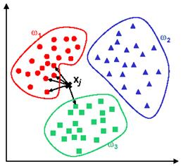

# KNN - k-nearest neighbor

KNN is a supervised classification algorithm.

"In a KNN algorithm, a test sample is given as the class of majority of its nearest neighbors. In plain words, if you are similar to your neighbors, then you are one of them. Or if apple looks more similar to banana, orange, and melon (fruits) than money, cat and rat (animals), then most likely apple is fruit."

"In the image, there are three classes and the problem is to find the class of Xj. In this case we use the Euclidean distance and a value of k=5 neighbors. Of the 5 closest neighbors, 4 belong to w1 and 1 belong to w3, so Xj is assigned to w1, the predominant class."

KNN is different from K-means. K-means is to solve unsupervised clustering problem. K-means belongs to the family of moving centroid algorithms.

# SVM - Support Vector Machines

The goal of SvM is to design a hyperplane that classifies all training vectors in two classes. The best choice will be the hyperplane that leaves the maximum margin from both classes.

