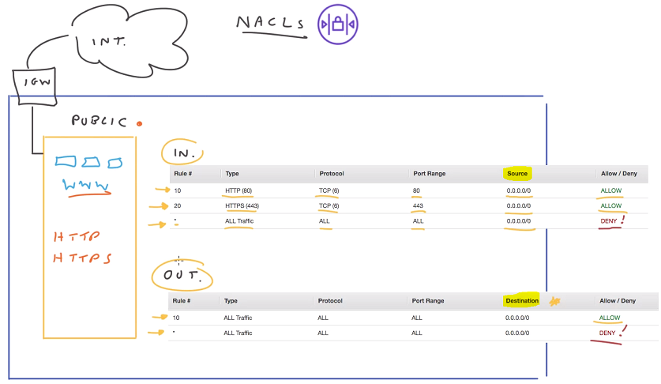
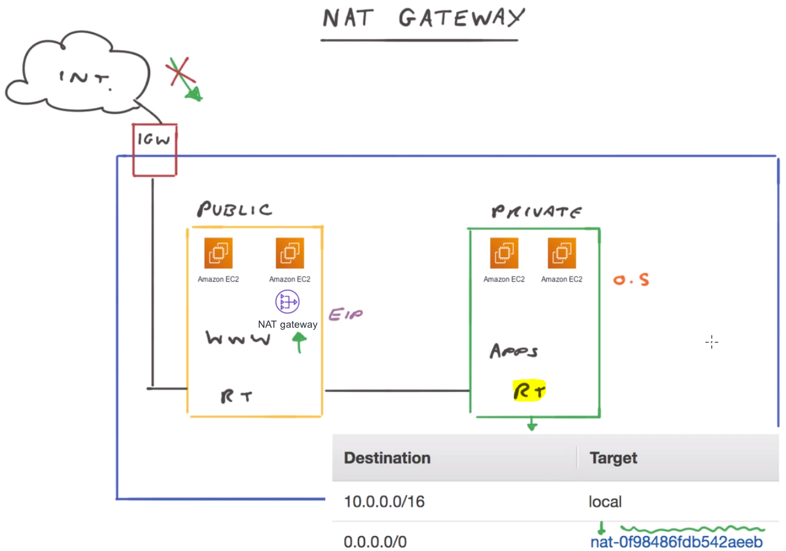
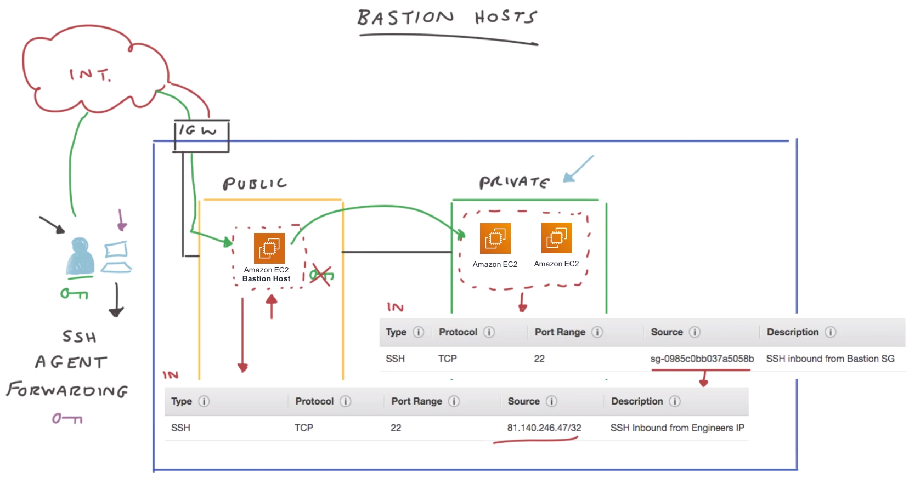
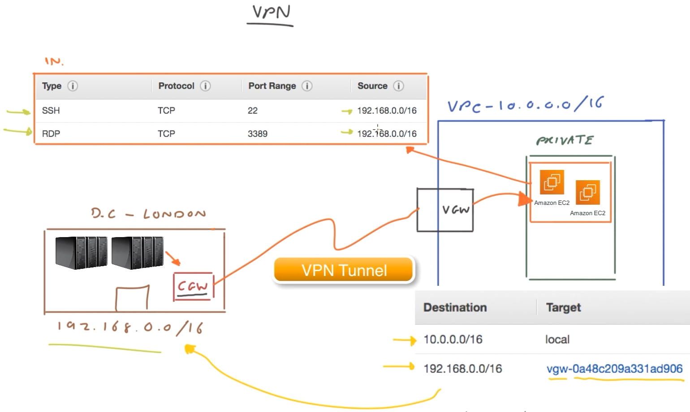
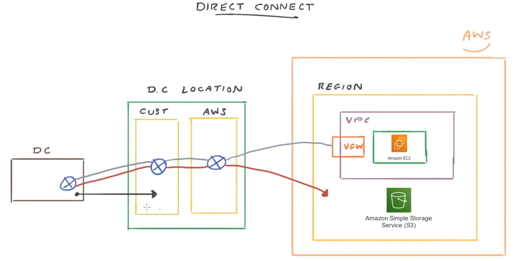
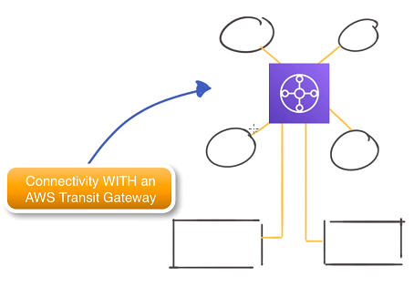

[Amazon Web Services](../pages/aws.md)

# AWS Network

- [VPC (Virtual Private Cloud)](#vpc-virtual-private-cloud)
  - [Subnet](#subnet)
  - [Route Table](#route-table)
- [VPC Security and Control](#vpc-security-and-control)
  - [NACLs (Network Access Control Lists)](#nacls-network-access-control-lists)
  - [Security Groups](#security-groups)
  - [NAT Gateway](#nat-gateway)
  - [Bastion Hosts](#bastion-hosts)
- [VPC Connectivity](#vpc-connectivity)
  - [VPN (Virtual Private Networks)](#vpn-virtual-private-networks)
  - [Direct Connect](#direct-connect)
  - [VPC Peering](#vpc-peering)
  - [Transit Gateway](#transit-gateway)
- [Basic Networking Concepts](#basic-networking-concepts)
  - [EIPs (Elastic IP Addresses)](#eips-elastic-ip-addresses)
  - [ENIs (Elastic Network Interfaces)](#enis-elastic-network-interfaces)
  - [ENA (Elastic Network Adaptor)](#ena-elastic-network-adaptor)
  - [VPC Endpoints](#vpc-endpoints)
- [AWS Global Accelerator](#aws-global-accelerator)
- [Design A Multi-Tier Solution](#design-a-multi-tier-solution)
- [DNS and Content Delivery](#dns-and-content-delivery)
  - [Amazon Route 53](#amazon-route-53)
  - [Amazon CloudFront](#amazon-cloudfront)
- [Simple Queue Service (SQS)](#simple-queue-service-sqs)
- [Simple Notification Service (SNS)](#simple-notification-service-sns)
- [Amazon Kinesis](#amazon-kinesis)
  - [Amazon Kinesis Streams](#amazon-kinesis-streams)
  - [Amazon Kinesis Data Firehose](#amazon-kinesis-data-firehose)
  - [Amazon Kinesis Analytics](#amazon-kinesis-analytics)

 

# VPC (Virtual Private Cloud)

When specify a CIDR (Classless Inter-Domain Routing) block address for your VPC, the range of the netmasks allowed is from a /16 netmask to a /28 netmask.

### Subnet
**Private subnet** is inaccessable from internet. Every time you create a subnet, it is by default a private subnet to begin with. When you create a subnet, you need to define a CIDR block range that fits within the VPC CIDR block.

**Public subnet** is a subnet that is accessable from internet and has public IP address. To make a subnet public, you need to 
- add an internet gateway (IGW)
  - IGW is attached to your VPC and acts as a gateway between your VPC and the outside world.
- add a route to the subnet's route table
  - all subnets within your VPC can communicate with each other due to the default configuration of route: local.

### Route Table

- you can have the same route table associated to multiple subnets.
- you can NOT associate more than one route table to a single subnet.
- route table contains a destination field (destination) and a target field (route to the destination).

 

# VPC Security and Control

NACLs are stateless. Security Groups are stateful.

### NACLs (Subnet Level)

NACLs (Network Access Control Lists) are essentially virtual **network-level** firewalls that are associated to each and every subnet and they help to control both ingress and egress traffic moving in and out of your VPC and between your subnets. By default, NACL allows all traffic both inbound and outbound. You can have the same NACL applied to a number of subnets. But only a single NACL can be associated to one subnet.

Inbound:
- Rule number
- Type: HTTP, HTTPS, All Traffic, etc.
- Protocol: TCP, etc.
- Port Range
- Source
- Allow / Deny

Outbound:
- Rule number
- Type: HTTPS, All Traffic, etc.
- Protocol: TCP, etc.
- Port Range
- Destination
- Allow / Deny

### Security Groups (Instance Level)
The security groups are used at the **Instance layer**. With Security Group, if there is a rule in there then it's considered allowed, if there's no rule, then all traffic is dropped by default.

- Type
- Protocol: TCP, etc.
- Port Range
- Source: 10.0.1.0/24, etc.

### NAT Gateway
A NAT Gateway allows private instances to be able to access the internet while **blocking connections initiated from the internet**. For example, we are responsible to update and patch the operating systems running on each of our EC2 instances. Then we need to be able to download updates as and when we need to. Private subnet has no access to the internet gateway and therefore the internet.

- Because **NAT Gateway sits in a public subnet**, it has to have a public IP address in the form of an EIP which is an Elastic IP address and this is assigned to the instance itself.
- The **route table** needs to be updated to provide a route to the NAT gateway.
- If you have multiple public subnets in different availability zones, you will need to set up another NAT gateway within that subnet as well.

### Bastion Hosts
How do engineers access an instance in a private subnet? One of the ways to do it is via a bastion host (used as a jump server). The bastion host sits within hte public subnet and it is just another EC2 instance. This instance needs to be very secure and it needs to be hardened and very robust. It needs to remove any kind of vulnerabilities and loose access controls.

This bastion host instance is in a security group that allows an SSH connection coming from engineers. The instance in the private subnet needs a security group that allows the SSH connection from the instances that are associated with the bastion host security group.

**SSH Agent Forwarding:**
- SSH Agent Forward is configured on the client.
- It stores EC2 private keys on the local client rather than on the bastion host.
- You use it to access instances through a bastion host.

 

# VPC Connectivity

## VPN (Virtual Private Networks)

VPN is essentially a secure way of connecting two remote networks across the internet.

If the customer gateway (CGW) supports Border Gateway Protocol (BGP), then this supports 
dynamic routing. so this will populate all the routes for the VPN connection for you, 
which means you won't have to implement any static routing.

## Direct Connect

Direct Connect does not use internet. It is totally isolated infrastructure.

## VPC Peering

- VPC peering connection is a one to one connection.
- When you create VPC peering connections, each VPC cannot have an IP address overlap
between them.
- We need to make sure that the CIDR blocks of the VPCs do not overlap.
- You can have VPC peering configured between the same region or between different
regions.
- Each VPC needs to update their routing tables to allow the traffic from one VPC to
get to the destination of another VPC.

## Transit Gateway

Transit gateway is essentially a development from the VPC peering. The AWS Transit 
Gateway simplifies your whole network connectivity. It allows all your VPCs to easily 
communicate with one another and also communicate with your remote locations as well.
All the routing is managed centrally within that hub and when any new remote
locations or VPCs are created, for example, you might have another two VPCs created. 
All you'd need to do is to connect it to the AWS Transit Gateway and each of these new 
VPCs can then communicate with the entire rest of your infrastructure.

 

# Basic Networking Concepts

### EIPs (Elastic IP Addresses)

- Pooled public IP address is not persistent. The pooled public IP address will change will you stop and start your instance. 
- When you create a persistent elastic IP address, the IP address is associated with your account rather than an instance. This means you can attach an EIP address to an instance or an Elastic Network Interface (ENI) and even if you stop the instance its associated with, the same EIP will remain in place.
- When you detach an EIP and it's not associated with a running instance, then you will incur a cost for it. When you don't need a EIP, you need to detach it from the instance and release it back to AWS.
- You can't convert an existing pooled public IP address to an EIP.

### ENIs (Elastic Network Interfaces)

- ENIs are logical virtual network cards within your VPC that you can create, configure and attach to your EC2 instances. The configuration is bound to the ENI and not the instance that it is attached to. 
- When you create an instance you EC2 instance comes configured with a primary network interface that is already bound to your instance. And this can't be removed or detached. It is labeled Eth0.
- VPC flow logs capture all traffic originating from or being sent to an ENI like your Eth0 interface.

### ENA (Elastic Network Adaptor)

The Elastic network Adapter (ENA) is a custom interface used to optimize network performance

- If you are looking to enable enhanced networking features to reach speeds of up to 100 Gbps for your linux compute instances, then you can do so using an ENA.
- In addition to 100 Gbps speeds, **EC2 Enhanced Networking with ENA** offers higher bandwith with increased packet per second (PPS) performance.
- It is offered at no extra cost.
- When launching an instance using Amazon Linux 2 or iwht the latest version of Amazon Linux AMI, then the instance will have **enhanced networking** enabled by default.
- Enhanced networking is enabled when the ENA module is installed on your instance and the ENA support attribute is set. 
  - To confirm the ENA module is installed, you can run modinfo ena from the terminal prompt.
  - To check the ENA support attribute is set, you can use the AWS CLI command.

### VPC Endpoints
VPC endpoints allow you to privately access AWS services using the AWS internal network instead of connecting to such services via the internet using public DNS endpoints. This means that you can connect to the supported services without configuring an Internet Gateway, NAT Gateway, a Virtual Private Network or a Direct Connect connection.

There are two types of VPC Endpoints: Interface Endpoints and Gateway Endpoints.
  - **Interface Endpoints** are essentially ENIs that are placed within a subnet that act as a target for any traffic that is being sent to a supported services and operates through the use of PrivateLink. (**PrivateLink** allows a private and secure connection between VPCs, AWS services, and on-premises applications, via the AWS internal network.)
    - When an interface endpoint is configured within your chosen subnet, the service that it is associated with is NOT able to initiate a connection through to your VPC, communication across this interface HAS to originate from within your VPC first before a response can be made by the service.
  - A **Gateway Endpoint** is a target that is used within your route tables to allow you to reach supported services, currently the only supported services using a Gateway Endpoint are Amazon S3 and DynamoDB, but this like is likely to change over time to please ensure you check the latest supported services.

 

# AWS Global Accelerator

- The ultimate aim of the AWS Global Accelerator is to get UDP and TCP traffic from your end user clients 
to your applications faster and quicker and more reliably, through the use of the AWS global infrastructure 
and specified endpoints, instead of having to traverse the public internet, which is not as reliable and 
carries a higher security risk.
- Global Accelerator uses two static IP addresses associated with a DNS name which is used as a fixed 
source to gain access to your application which could be sitting behind a load balancer, such as a network 
or application load balancer, or directly connected to your EC2 instance or the Elastic IP address. These 
IP addresses can be mapped to multiple different endpoints, each operating in a different region if a 
multi-region application is deployed to enhance performance of routing choices.

 

# Design A Multi-Tier Solution
  
**Multi-Tier Architecture:**
- A design doesn't have to have three tiers. They can be more or less.
   - Presentation tier
   - Logic tier
   - Data tier (Amazon Aurora, Amazon ElastiCache)
- It common to have web applications to have two tiers. 
- Multi-tier architecture provides a general framework to ensure decoupled and independently
scalable application components can be developed, managed and maintained separately. 
- In multi-tier architecture, each layer (tier) is independent of the other layers. Each layer can be scaled up
or down to meet specific demand.

**Common Multi-Tier Solution Design Patterns:**
- LAMP
  - LAMP is a common tool stack used for building web services
  - **L**inux operation system
  - **A**pache web server
  - **M**ySQL database
  - **P**HP programming languange
- MEAN
  - MEAN is an evolving stack pattern
  - **M**ongo DB (database layer)
  - **E**xpressJS (javascript framework)
  - **A**ngularJS (javascript framework)
  - **N**odeJS (javascript framework)
- SERVERLESS
  - Serverless is very beneficial in multi-tiered designs.
  - Generally use **Amazon API Gateway** and **AWS Lambda** to replace logic tier.
  - Generally one lambda function per API or one Lambda function per API method
- MICROSERVICES
  - Microservices is not so tied to the notion of tiers.
  - With microservice architecture patterns each of the application components is decoupled and independently
  deployed and operated.

 

# DNS and Content Delivery

DNS (Domain Name System) is a hierarchical distributed naming system for computers, services or any resource
connected to the internet or a private network. It is responsible of the translation of domain 
names (ex. amazon.com) to IP addresses.

## Amazon Route 53

Amazon Route 53 is Amazon's highly available and scalable domain name system (DNS). It provides secure and 
reliable routing of requests, both for services within AWS and infrastructure that is outside of AWS. It provides
this service through its global network of authoritative DNS servers that reduce latency and can be managed via 
the management console and API.

### Hosted Zones

- A hosted zone is a container that holds information about how you want to route traffic for a domain such as
amazon.com. Route 53 supports the following type of zones:
  - Public Hosted Zone: This zone determines how traffic is routed on the internet and can be created 
  when you register your domain with Route 53.
  - Private Hosted Zone: For Amazon VPC, this zone determines how traffic is routed within the Amazon VPC. 
  If your resources are not accessible outside of the VPC you can use any domain name you wish.

### Domains

- There are different domains that are supported by Route 53:
  - Generic Top-Level Domains (TLDs): .watch .clothing
  - Geographic Domains: .com.au .uk

### Resource Record Types

Route 53 supports the most common Resource Record types: A, AAAA, CAA, CNAME, MX, NAPTR, NS, PTR, SOA, SPF, SRV, TXT.

In addition to these record types, Route 53 also uses **alias records**, which are a Route 53 specific extension to DNS.
These alias records which act like a CNAME record allow you to route your traffic to other AWS resources, such as
Elastic load balancers, Elastic Beanstalk environments, CloudFront distributions, VPC interface endpoints, or S3
buckets configured as static websites.

### Routing Policies

When you create a resource record set, you must choose a routing policy that will be applied to it, and this
then determines how Route 53 will respond to these queries. 

- Simple Routing Policy (default)
- Failover Routing Policy
- Geo-Location Routing Policy (based on the users)
- Geoproximity Routing Policy (based on both the users and the resources)
- Latency Routing Policy
- Multivalue Answer Routing Policy
- Weighted Routing Policy

## Amazon CloudFront

Amazon CloudFront is AWS's fault-tolerant and globally scalable **content delivery network (CDN)service**. It 
provides seamless integration with other Amazon Web Services to provide an easy way to distribute content. When using 
CloudFront, content requests are **routed to the closest edge** to the user's location which provides the lowest 
latency to deliver the best performance **through cached data**.

When configuring your **distribtions**, you will be required to enter your origin information which is essentially
where the distribution is going to get the data to distribute across edge locations and it will be the DNS names
of the S3 bucket or the HTTP server. 

- Web distribution
- RTMP distribution: Distribute streaming media with the Adobe Flash media service RTMP protocol. Source can only be 
located in S3 bucket and not in a EC2 web server.

If using an S3 bucket as your origin, then for additional security you can create a CloudFront user 
called an **origin access identity (OAI)**. This ensures that only this OAI can access and serve content 
from your bucket and therefore preventing anyone circumventing your CloudFront distribution by accessing
the files directly in the bucket using the object URL.

**Caching behavior options** defines how you want the data at the edge location to be cached via
various methods and policies.

You can also define if you want your distribution to be **associated to a web application firewall access
control list** for additional security and web application protection.

In addition to using a web application firewall access control list, you can also **implement additional 
encryption security by specifying an SSL certificate** that must be used with a distribution.

 

# Simple Queue Service (SQS)

- SQS is a fully managed service that works with serverless systems, microservices and distributed architectures.
- It has the capability of sending, storing and receiving messages at scale without dropping message data.
- It is possible to configure the service using the AWS Management Console, the AWS CLI or AWS SDKs.

SQS Queue Types:
- Standard Queues
  - Standard queues support at-least-once delivery of messages
  - They offer a best effort on trying to preserve the message ordering (don't use this if ordering is critical).
  - They provide almost unlimited number of transactions per second.
- FIFO Queues
  - The order of messages is maintained and there are no duplicates.
  - Limited number of transaction per second (defaulted to 300 TPS).
  - Batching allows you to perform actions against 10 messages at once with a single action.
- Dead-Letter Queues
  - The dead-letter queue sends messages that fail to be processed
  - this could be the result of code within your application, corruption within the message or simply missing 
  information.
  - If the message can't be processed by a consumer after a maximum number of tries specified, the queue will 
  send the message to a DLQ.
  - By viewing and analysing the content of the message it might be possible to identify the problem and ascertain
  the source of the issue. 

 

# Simple Notification Service (SNS)

SNS offers methods of controlling specific access to your topics through a topic policy. For example, you
can restrict which protocol subscribers can use, such as SMS or HTTPS, or only allow access to this topic
for a specific user. The topic policy follows the same format as IAM policies. To configure an SNS, start 
from creating a topic.

Use SNS as a producer for an SQS queue: SNS and SQS by working together, a solution can be designed to 
send messages to subscribers through a push method, while SQS handles incoming messages and waits for 
consumers to pull data.

 

# Amazon Kinesis

Amazon Kinesis does not store persistent data itself, unlike many of the other amazon big data services. As a 
result, Amazon Kinesis needs to be deployed as part of a larger event-driven solution. Amazon Kinesis provides
three different solution capabilities:

## Amazon Kinesis Streams

Amazon Kinesis Streams enables you to build custom applications that process or analyze streaming data 
for specialized needs.

- Data streams: A data streaming service capable of elastically scaling to support thousands of data feeds.
- Video streams: Designed to securely elastically scale and ingest video streams on a massive scale.

An Amazon Kinesis stream is an ordered sequence of data records. A record is the unit of data in an Amazon
Kinesis stream. Each record in the stream is composed of **a sequence number**, **a partition key** and 
**a data blob**.

A consumer receives records from Amazon Kinesis Streams and processes them in real-time. You need to build your
applications using either the Amazon Kinesis API, or the Amazon Kinesis Client Library.

## Amazon Kinesis Data Firehose

Amazon Kinesis Firehose is a fully namaged service for delivering real-time streaming data to destinations 
such as Amazon S3, Amazon RedShift, and Amazon Elastic Search and Splunk.

With Kinesis Firehose, you do not need to write applications as your consumers. You can also configure 
Amazon Kinesis Firehose to transform your data before data delivery.

Firehose is limited to S3, Redshift, Elasticsearch and Splunk as the data destinations.

## Amazon Kinesis Analytics

Amazon Kinesis Analytics enables you to quickly author SQL code that continuously reads, processes and 
stores data. You can ingest in real-time billions of small data points. Each individual data point can then 
be aggregated to provide intelligent business insights, which in turn can be used to continually optimize 
and improve business processes.

- Create an input stream: Typically come from streaming data sources such as Kinesis streams
- Create SQL processing logic
- Create an output stream: to hold intermediate results that are used to feed into other queries or be used to 
stream out the final results.

