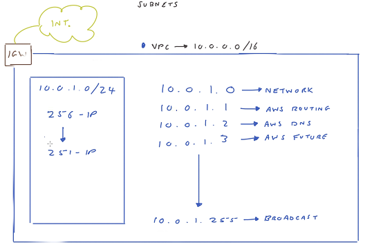
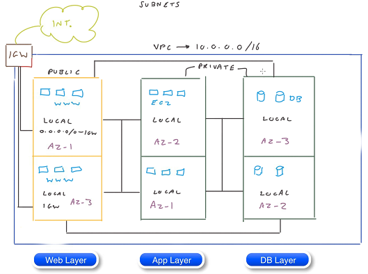

# AWS Network

# VPC (Virtual Private Cloud)

CIDR (Classless Inter-Domain Routing) Block range

 

# Subnet

Every time you create a subnet, it is a private subnet to begin with and that is until you attach an Internet 
Gateway (IGW) to your VPC and then add the additional route to the IGW. Private subnet: inaccessable by 
default from internet.

When you create a subnet, you need to define a CIDR block range that fits within the VPC CIDR block.

## Public subnet: 

Public subnet is a subnet that has (1) accessable from internet; and (2) public IP address. 
To make a subnet public, you need to 
- add an internet gateway (IGW)
  - IGW is attached to your VPC and acts as a gateway between your VPC and the outside world.
- add a route to the subnet's route table
  - all subnets within your VPC can communicate with each other due to the default configuration of route: local.

### Route Table

- you can have the same route table associated to multiple subnets.
- you can NOT associate more than one route table to a single subnet.
- route table contains a destination field (destination) and a target field (route to the destination).

