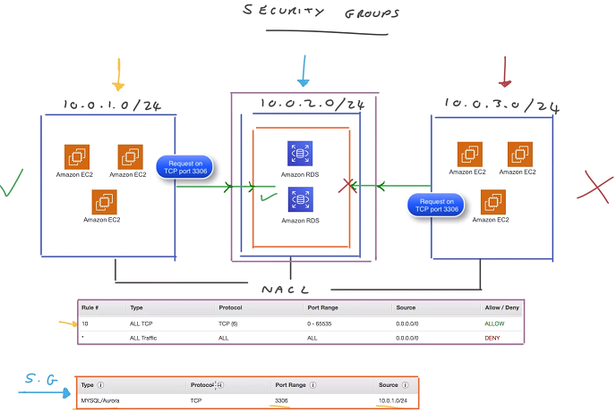

# AWS Network

- [VPC (Virtual Private Cloud)](#vpc-virtual-private-cloud)
  - [Subnet](#subnet)
  - [Public Subnet](#public-subnet)
  - [Route Table](#route-table)
- [VPC Security and Control](#vpc-security-and-control)
  - [NACLs (Network Access Control Lists)](#nacls-network-access-control-lists)
  - [Security Groups](#security-groups)
  - [NAT Gateway](#nat-gateway)
  - [Bastion Hosts](#bastion-hosts)
- [VPC Connectivity](#vpc-connectivity)
  - [VPN (Virtual Private Networks)](#vpn-virtual-private-networks)
  - [Direct Connect](#direct-connect)
  - [VPC Peering](#vpc-peering)
  - [Transit Gateway](#transit-gateway)
- [EIPs (Elastic IP Addresses)](#eips-elastic-ip-addresses)
- [ENIs (Elastic Network Interfaces)](#enis-elastic-network-interfaces)
- [ENA (Elastic Network Adaptor)](#ena-elastic-network-adaptor)
- [VPC Endpoints](#vpc-endpoints)
- [AWS Global Accelerator](#aws-global-accelerator)

 

# VPC (Virtual Private Cloud)

When specify a CIDR (Classless Inter-Domain Routing) block address for your VPC, the range of the netmasks allowed is 
from a /16 netmask to a /28 netmask.

 

## Subnet

Every time you create a subnet, it is a private subnet to begin with and that is until you attach an Internet 
Gateway (IGW) to your VPC and then add the additional route to the IGW. Private subnet: inaccessable by 
default from internet.

When you create a subnet, you need to define a CIDR block range that fits within the VPC CIDR block.

## Public Subnet

Public subnet is a subnet that has 
- accessable from internet
- public IP address
 
To make a subnet public, you need to 
- add an internet gateway (IGW)
  - IGW is attached to your VPC and acts as a gateway between your VPC and the outside world.
- add a route to the subnet's route table
  - all subnets within your VPC can communicate with each other due to the default configuration of route: local.

## Route Table

- you can have the same route table associated to multiple subnets.
- you can NOT associate more than one route table to a single subnet.
- route table contains a destination field (destination) and a target field (route to the destination).

 

# VPC Security and Control

## NACLs (Network Access Control Lists)

NACLs are essentially virtual **network-level** firewalls that are associated to each and every subnet and 
they help to control both ingress and egress traffic moving in and out of your VPC and between your 
subnets.

- You can have the same NACL applied to a number of subnets.
- Only a single NACL can be associated to one subnet.

## Security Groups

The security groups are used at the **Instance layer**. With Security Group, if there is a rule in there 
then it's considered allowed, if there's no rule, then all traffic is dropped by default.

## NAT Gateway

A NAT Gateway allows private instances to be able to access the internet while blocking connections 
initiated from the internet. For example, we are responsible to update and patch the operating 
systems running on each of our EC2 instances. Then we need to be able to download updates as and when 
we need to. Private subnet has no access to the internet gateway and therefore the internet.

- Because **NAT Gateway sits in a public subnet**, it has to have a public IP address in the form of an EIP
which is an Elastic IP address and this is assigned to the instance itself.
- The **route table** needs to be updated to provide a route to the NAT gateway.
- If you have multiple public subnets in different availability zones, you will need to set up another 
NAT gateway within that subnet as well.

## Bastion Hosts

How do engineers access an instance in a private subnet? One of the ways to do it is
via a bastion host (used as a jump server).

SSH agent forwarding:
- it stores EC2 private keys on the local client.
- you use it to access instances through a bastion host.

 

# VPC Connectivity

## VPN (Virtual Private Networks)

VPN is essentially a secure way of connecting two remote networks across the internet.

If the customer gateway (CGW) supports Border Gateway Protocol (BGP), then this supports 
dynamic routing. so this will populate all the routes for the VPN connection for you, 
which means you won't have to implement any static routing.

## Direct Connect

Direct Connect does not use internet. It is totally isolated infrastructure.

## VPC Peering

- VPC peering connection is a one to one connection.
- When you create VPC peering connections, each VPC cannot have an IP address overlap
between them.
- We need to make sure that the CIDR blocks of the VPCs do not overlap.
- You can have VPC peering configured between the same region or between different
regions.
- Each VPC needs to update their routing tables to allow the traffic from one VPC to
get to the destination of another VPC.

## Transit Gateway

Transit gateway is essentially a development from the VPC peering. The AWS Transit 
Gateway simplifies your whole network connectivity. It allows all your VPCs to easily 
communicate with one another and also communicate with your remote locations as well.
All the routing is managed centrally within that hub and when any new remote
locations or VPCs are created, for example, you might have another two VPCs created. 
All you'd need to do is to connect it to the AWS Transit Gateway and each of these new 
VPCs can then communicate with the entire rest of your infrastructure.

# EIPs (Elastic IP Addresses)

- Pooled public IP address is not persistent. The pooled public IP address will change will you 
stop and start your instance. 
- When you create a persistent elastic IP address, the IP address is associated with your 
account rather than an instance. This means you can attach an EIP address to an instance 
or an Elastic Network Interface (ENI) and even if you stop the instance its associated 
with, the same EIP will remain in place.
- When you detach an EIP and it's not associated with a running instance, then you will 
incur a cost for it. When you don't need a EIP, you need to detach it from the instance
and release it back to AWS.
- You can't convert an existing pooled public IP address to an EIP.

 

# ENIs (Elastic Network Interfaces)

- ENIs are logical virtual network cards within your VPC that you can create, configure and attach
to your EC2 instances. The configuration is bound to the ENI and not the instance that it is attached
to. 
- When you create an instance you EC2 instance comes configured with a primary network interface
that is already bound to your instance. And this can't be removed or detached. It is labeled Eth0.
- VPC flow logs capture all traffic originating from or being sent to an ENI like your Eth0 interface.

 

# ENA (Elastic Network Adaptor)

- In addition to 100 Gbps speeds, enhanced networking offers higher bandwith with increased packet
per second (PPS) performance.
- It is offered at no extra cost.
- Enhanced networking is enabled when the ENA module is installed on your instance and the ENA support
attribute is set. 
  - To confirm the ENA module is installed, you can run modinfo ena from the terminal prompt.
  - To check the ENA support attribute is set, you can use the AWS CLI command.

 

# VPC Endpoints

- VPC endpoints allow you to privately access AWS services using the AWS internal network instead of 
connecting to such services via the internet using public DNS endpoints. This means that you can connect
to the supported services without configuring an Internet Gateway, NAT Gateway, a Virtual Private
Network or a Direct Connect connection.
- There are two types of VPC Endpoints: Interface Endpoints and Gateway Endpoints.
  - **Interface Endpoints** are essentially ENIs that are placed within a subnet that act as a target for 
  any traffic that is being sent to a supported services and operates through the use of PrivateLink. 
  **PrivateLink** allows a private and secure connection between VPCs, AWS services, and on-premises 
  applications, via the AWS internal network.
  - When an interface endpoint is configured within your chosen subnet, the service that it is associated 
  with is NOT able to initiate a connection through to your VPC, communication across this interface HAS 
  to originate from within your VPC first before a response can be made by the service.
  - A **Gateway Endpoint** is a target that is used within your route tables to allow you to reach supported 
  services, currently the only supported services using a Gateway Endpoint are Amazon S3 and DynamoDB, but 
  this like is likely to change over time to please ensure you check the latest supported services.

 

# AWS Global Accelerator

- The ultimate aim of the AWS Global Accelerator is to get UDP and TCP traffic from your end user clients 
to your applications faster and quicker and more reliably, through the use of the AWS global infrastructure 
and specified endpoints, instead of having to traverse the public internet, which is not as reliable and 
carries a higher security risk.
- Global Accelerator uses two static IP addresses associated with a DNS name which is used as a fixed 
source to gain access to your application which could be sitting behind a load balancer, such as a network 
or application load balancer, or directly connected to your EC2 instance or the Elastic IP address. These 
IP addresses can be mapped to multiple different endpoints, each operating in a different region if a 
multi-region application is deployed to enhance performance of routing choices.

