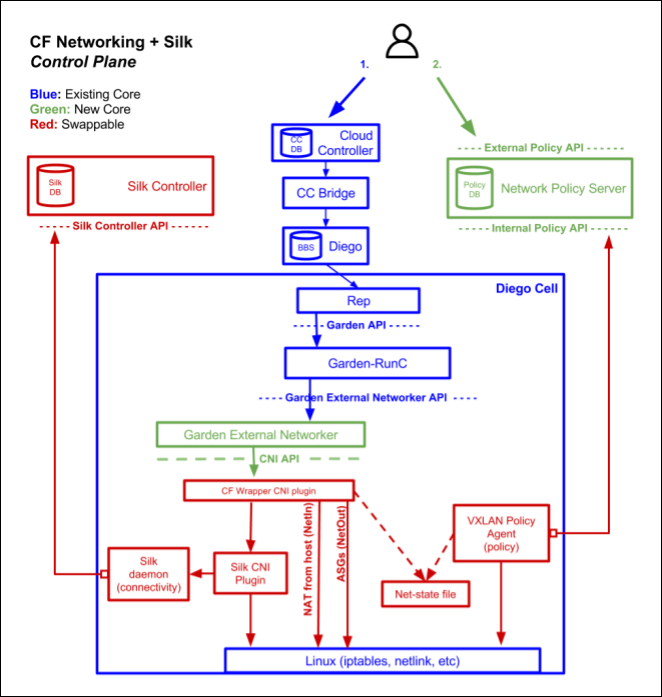
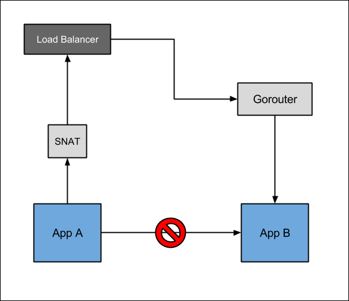
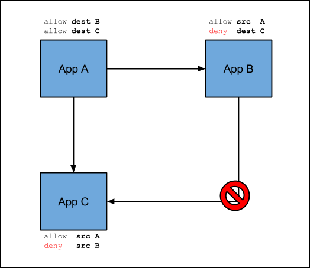

# Container-to-Container Networking

Refer to https://docs.cloudfoundry.org/concepts/understand-cf-networking.html

When the Container-to-Container Networking feature is disabled, all app-to-app traffic must go through the Gorouter.

Container-to-Container Networking integrates with Garden-runC in a Diego deployment. The Container-to-Container Networking BOSH release includes several core components, as well as swappable components.

## Without Container-to-Container Networking

## With Container-to-Container Networking

## Container-to-Container Networking versus ASGs

|  | ASGs | Container-to-Container Networking Policies |
| --- | --- | --- |
| Policy granularity | From a space to an IP address range | From a source app to a destination app |
| Scope | For a space, org, or deployment | For app to app only |
| Traffic direction | Outbound control | Policies apply for incoming packets from other app instances |
| Source app | Is not known | Is identified because of direct addressability |
| Policies take affect | After app restart | Immediately |

> Application Security Groups (ASGs) apply network traffic rules at the container level.

## Policies

Enabling Container-to-Container Networking for your deployment allows you to create policies for communication between app instances. The Container-to-Container Networking feature also provides a unique IP address to each app container and provides direct IP reachability between app instances.

The policies you create specify a source app, destination app, protocol, and port so that app instances can communicate directly without going through the Gorouter, a load balancer, or a firewall. Container-to-Container Networking supports UDP and TCP, and you can configure policies for multiple ports. These policies apply immediately without having to restart the app.

