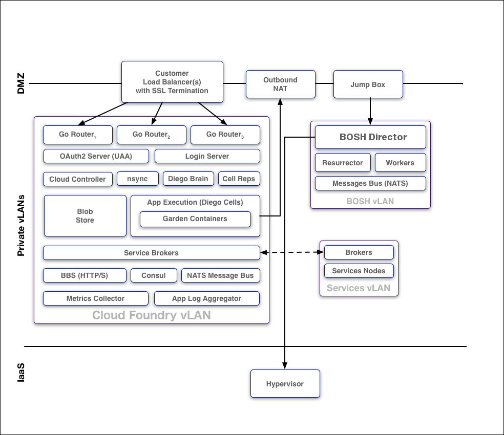
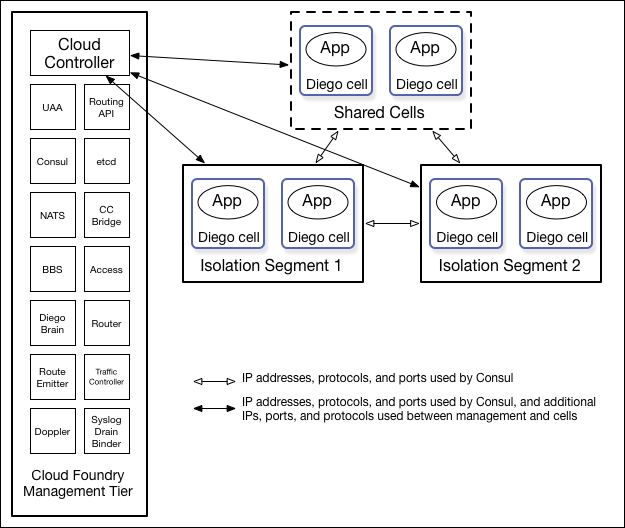

# Cloud Foundry Security

Refer to https://docs.cloudfoundry.org/concepts/security.html

## System Boundaries and Access

As the image below shows, in a typical deployment of Cloud Foundry, the components run on virtual machines (VMs) that exist within a VLAN. In this configuration, the only access points visible on a public network are a load balancer that maps to one or more Cloud Foundry routers and, optionally, a NAT VM and a jumpbox. Because of the limited number of contact points with the public internet, the surface area for possible security vulnerabilities is minimized.

## Protocols

All traffic from the public internet to the Cloud Controller and UAA happens over HTTPS. Inside the boundary of the system, components communicate over a publish-subscribe (pub-sub) message bus NATS, HTTP, and SSL/TLS.

## BOSH

Operators deploy Cloud Foundry with BOSH. The BOSH Director is the core orchestrating component in BOSH: it controls VM creation and deployment, as well as other software and service lifecycle events. You use HTTPS to ensure secure communication to the BOSH Director.

> BOSH does not encrypt data stored on BOSH VMs. Your IaaS might encrypt this data.

## Isolation Segments

Isolation segments provide dedicated pools of resources to which apps can be deployed to isolate workloads. Using isolation segments separates app resources as completely as if they were in different CF deployments but avoids redundant management components and unneeded network complexity.

You can designate isolation segments for exclusive use by orgs and spaces within CF. This guarantees that apps within the org or space use resources that are not also used by other orgs or spaces.

## Authentication and Authorization

User Account and Authentication (UAA) is the central identity management service for Cloud Foundry and its various components.

## Managing User Access with Role-Based Access Control (RBAC)

## Security for Service Broker Integration

The Cloud Controller authenticates every request with the Service Broker API using HTTP or HTTPS, depending on which protocol that you specify during broker registration. The Cloud Controller rejects any broker registration that does not contain a username and password.

Service instances bound to an app contain credential data. Users specify the binding credentials for user-provided service instances, while third-party brokers specify the binding credentials for managed service instances. The VCAP_SERVICES environment variable contains credential information for any service bound to an app. Cloud Foundry constructs this value from encrypted data that it stores in the Cloud Controller Database (CCDB).

## Software Vulnerability Management

Cloud Foundry manages software vulnerability using releases and BOSH stemcells. New Cloud Foundry releases are created with updates to address code issues, while new stemcells are created with patches for the latest security fixes to address any underlying operating system issues.

## Security Event Logging and Auditing

For operators, Cloud Foundry provides an audit trail through the bosh tasks command. This command shows all actions that an operator has taken with the platform. Additionally, operators can redirect Cloud Foundry component logs to a standard syslog server using the syslog_daemon_config property in the metron_agent job of cf-release.

For users, Cloud Foundry records an audit trail of all relevant API invocations of an app. The Cloud Foundry Command Line Interface (cf CLI) command cf events returns this information.

