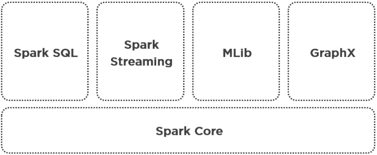

# Spark

- Spark Web UI port: 4040.

- Spark History Server port: 18089

- **Action:** Triggers the computation

- **Coarse Grained Transformations:** Operations that can be applied to the whole 
dataset, like map, filter, group, reduce among others.

- **Closures:** Code and variables required to execute computation in each distributed
node over a partition of data.

- **Stages**

- **Shuffle:** The process of moving the data between partitions 

- **Shuffle Boundary**

- **RDD Lineage**: Graph of transformation operations required to execute when an action
is called. RDD operator graph or RDD dependency graph.

- **DAG**: Directed Acyclic Graph.

- **Pipeline vs. Parallel**

- **Parent and Child RDD**

 

## Narrow Transformation & Wide Transformation

- **Narrow Transformation**: There is no interaction or dependency or relationship with other lines.
- **Wide Transformation**: There is an interaction or dependency or relationship across partitions.

 

## SparkContext & SparkSession

| **SparkContext**                        | **SparkSession**                       |
| --------------------------------------- | -------------------------------------- |
| Located in the Spark Driver             | Merges SQLContext and HiveContext      |
|                                         | Access SparkContext                    |
| Entry point for RDDs                    | Entry point to Spark SQL               |
| One SparkContext per application        | Can have multiple SparkSession objects |
| Created for you in REPL                 | Created for you in REPL                |
| You need to create for spark2-submit    | You need to create for spark2-submit   |

 

## Map, Filter & Reduce

### Map: apply a function to all items on a list

~~~
def add_one(this_item):
    return this_item + 1

numbers_list = [1, 2, 3, 4, 5]

map(add_one, numbers_list)
~~~

output: [2, 3, 4, 5, 6]

### Filter: create new list for items that meet certain criteria

~~~
def is_even(this_item):
    return this_item % 2 == 0

numbers_list = [1, 2, 3, 4, 5]

filter(is_even, numbers_list)
~~~

output: [2, 4]

### Reduce: perform a computation on a list

~~~
def add_items(first, second):
    return first + second

numbers_list = [1, 2, 3, 4, 5]

reduce(add_items, numbers_list)
~~~

output: 15

